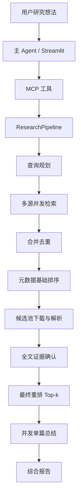

# 总体架构

## 设计原则

- MCP 负责标准化暴露能力，`ResearchPipeline` 负责确定性编排。
- Agent/LLM 是可替换组件，不直接控制文件系统、网络和无限重试。
- Streamlit 与 MCP 共用同一个应用层，避免两套流程出现结果差异。
- 所有阶段返回结构化对象，未知值用 `None`，部分失败保留警告。
- 先处理候选池全文，再做最终 Top-k，以支持失败补位。

## 正确的执行顺序

1. **意图结构化与查询规划**：解析研究对象、方法、任务、时间范围、必须词和排除词；为不同来源生成查询。
2. **多源并发检索**：只取元数据，不在检索器中下载全文。
3. **规范化、合并与去重**：保留 provenance 和字段冲突。
4. **低成本基础排序**：标题/摘要双塔召回或 BM25+embedding，截取全文处理候选池。
5. **OA 定位、下载与 Markdown 解析**：设置并发上限、超时、限流、缓存和 PDF 校验。
6. **全文证据确认**：判断论文是否真正支持用户关心的任务与约束；解析失败时按策略降级或淘汰。
7. **最终重排**：使用全文证据和用户侧重点，输出分项分数与理由，选出 Top-k。
8. **并发单篇总结**：每个关键结论绑定 evidence reference。
9. **综合报告**：跨论文对比、共识/分歧、空白和未来方向；不得把模型建议伪装成论文结论。

## 组件所有权

| 组件 | 建议负责人 | 输入 | 输出 |
|---|---|---|---|
| Domain Models / Pipeline | 总体架构组 | `PipelineRequest` | `PipelineResult` |
| QueryPlanner / Retrievers | 检索组 | `ResearchIdea` / `SearchPlan` | 查询计划 / `Paper[]` |
| Merger | 检索组 | 多源 `Paper[]` | 去重后的 `Paper[]` |
| FullTextProcessor | 论文处理组 | `Paper` | 带全文资产的 `Paper` |
| PaperSummarizer | 论文处理组 | 论文 + 研究想法 | `PaperSummary` |
| PreRanker / Verifier / FinalRanker | 排序组 | 候选论文 | 可解释排序论文 |
| ReportWriter | 排序组 | Top-k + summaries | `ResearchReport` |
| Streamlit / MCP / 集成测试 | 总体架构组 | 上述 ports | Demo 与验收结果 |

## 关键工程决策

### 不把整个系统藏在一个不透明 Agent 中

可评测任务应走确定性流水线；查询改写、语义判别和写报告可调用 LLM，但每次调用的输入、输出 Schema、模型版本、提示词版本和耗时必须记录。

### 两种 MCP 工具粒度

课程 Demo 首选一个粗粒度 `research_papers` 工具，避免主 Agent 逐篇传输大文本。调试阶段可额外暴露原子工具，但原子工具仍调用同一应用服务，不复制业务逻辑。

### 数据与权限

只下载确认可公开访问的 PDF。`is_open_access` 与 `access_status` 分开保存，因为前者可能来自元数据判断，后者是本次解析流程的实际状态。闭源论文可以保留元数据，但不能宣称完成全文总结。

